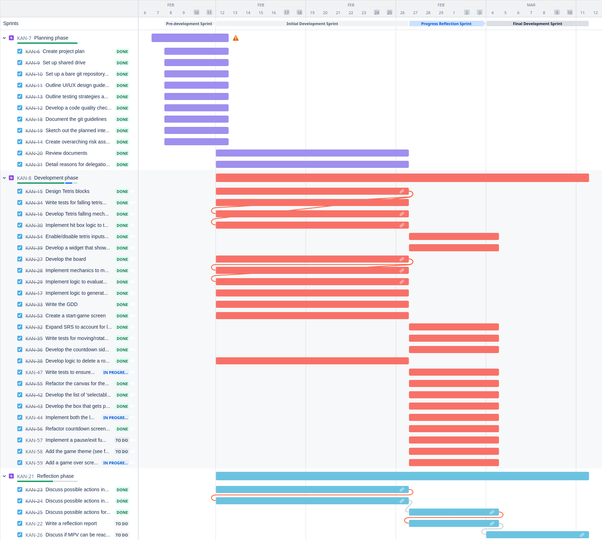

# BlockSum

BlockSum, designed specifically for ages 11 to 14, helps students to practise and learn concepts of mental mathematics, solidifying concepts like BODMAS/ BIDMAS by building on the mechanics of the game “tetris” and thereby enables critical thinking within a limited time frame. The game integrates the challenge of solving maths puzzles with the classic gameplay of Tetris, running in a grid of 20x10. Players are presented with a maths problem featuring a random target number and a set of selectable numbers and operations, which they have to complete before the tetris block descending from the top reaches the bottom of the screen.  

The goal is to combine these elements in the correct sequence to match the target number, thereby solving the puzzle. Upon solving each maths problem, the game transitions to a Tetris mode, where the player can manipulate this block by rotating it or moving it horizontally, aiming to place it strategically on the tetris board. If a user manages to get 10 sums correctly, then the difficulty will increase and more operations will become available.

## Installation

If you want to play the game, download the latest release. (TODO: add release and link to it)

## Developing

### Requirements

If you are developer and making changes to the codebase, you will need the following software:

* install Unity
    * version `2022.3.19f1 - LTS`
* install Mono build modules

### Making Changes

When implementing a feature, or making a change, **create a new branch**, and ensure that commit messages adhere to the [git guidelines](https://docs.google.com/document/d/1Y1Q6R-XL3syX2BAXB9C_Zbf0zAZp1zbzIQZqlZ35okk/edit#heading=h.jb5juw1oa1kp) (you might need to email the admin to get access).

Please ensure changes stick to the [code quality checklist](https://docs.google.com/document/d/1eaAv8zQ5k0_7TzRDYfnEyJ6W0VUQOyHI/edit?usp=drive_link&ouid=101840536409684563691&rtpof=true&sd=true) (you might need to email the admin to get access). This checklist ensures that coding style is consistent across files and readable to others.

### Testing

It is often helpful to couple code changes with respective **unit tests**. From https://artoftesting.com/levels-of-software-testing:

>Unit Testing is the first level of testing usually performed by the developers.
In unit testing, a module or component is tested in isolation.
As the testing is limited to a particular module or component, exhaustive testing is possible.
Advantage – Error can be detected at an early stage saving time and money to fix it.
Limitation – Integration issues are not detected in this stage, modules may work perfectly on isolation but can have issues in interfacing between the modules.

* for scripts, create a unit test that uses `NUnit`
* for scenes, it might be more applicable to use the `UnityEngine.TestTools`

## Roadmap

For our lastest backlog, see the [Jira](https://softwaremanagement7.atlassian.net/jira/software/projects/KAN/boards/1) (you might need to email the admin to get access).

<figure>
    
    <figcaption>Caption: Kanban Timeline Visualization.</figcaption>
</figure>

## Additional Resources and Documents

For our lastest documentation, see the [Google Drive](https://drive.google.com/drive/folders/1VjtYpsaRCfMeaAVB4EpZ5Sd73L3x3VOc?usp=sharing) (you might need to email the admin to get access).

> ⚠️ **Note:** In the drive, you will see a [File Tracker](https://docs.google.com/document/d/11cj39ifaHWl4gBBb5XBqosJ7plGVauwdEXO6lX8nRzI/edit?usp=drive_link) which might be helpful if you are struggling to find what you are looking for.
